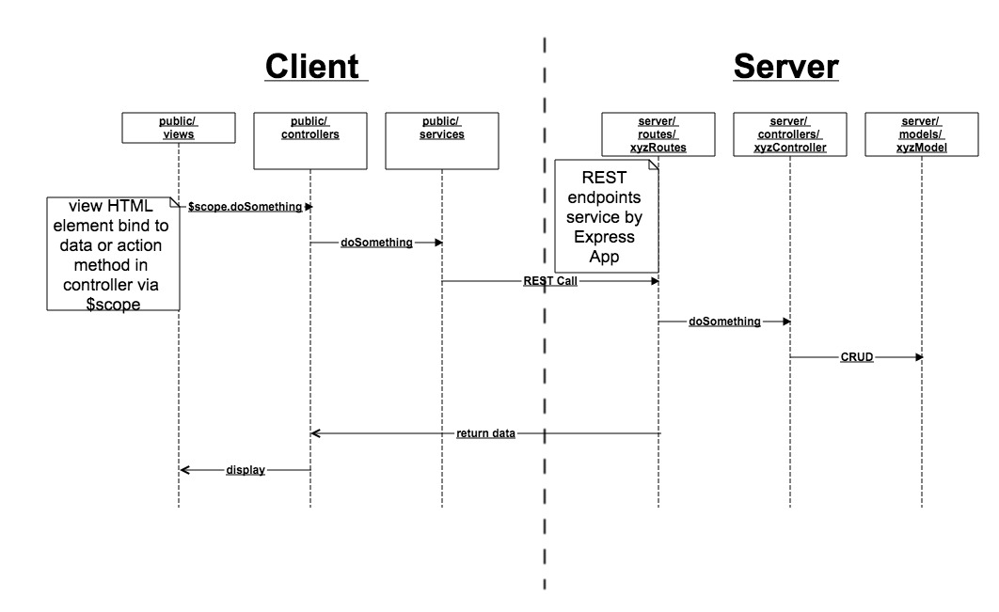

QAPortal - Sapling Team's project that use the MEAN stack.

## Open Sources
* *Code Generator* - <a href="https://github.com/linnovate/mean</a>
* *Dashboard* - <a href="https://github.com/angular-dashboard-framework/angular-dashboard-framework</a>
* *Chart* - <a href="https://github.com/jtblin/angular-chart.js</a>
* *Table* - <a href="https://github.com/lorenzofox3/Smart-Table</a>

## Prerequisite Technologies
### Linux
* *Node.js* - <a href="http://nodejs.org/download/">Download</a> and Install Node.js, nodeschool has free <a href=" http://nodeschool.io/#workshoppers">node tutorials</a> to get you started. We recommend node-4.x as the preffered node version to run mean.io.
* *MongoDB* - <a href="https://www.mongodb.org/downloads">Download</a> and Install mongodb - <a href="https://docs.mongodb.org/manual/">Checkout their manual</a> if you're just starting.


* *Git* - Get git using a package manager or <a href="http://git-scm.com/downloads">download</a> it.

### Windows
* *Node.js* - <a href="http://nodejs.org/download/">Download</a> and Install Node.js, nodeschool has free <a href=" http://nodeschool.io/#workshoppers">node tutorials</a> to get you started.
* *MongoDB* - Follow the great tutorial from the mongodb site - <a href="https://docs.mongodb.org/manual/tutorial/install-mongodb-on-windows/">"Install Mongodb On Windows"</a>
* *Git* - The easiest way to install git and then run the rest of the commands through the *git bash* application (via command prompt) is by downloading and installing <a href="http://git-scm.com/download/win">Git for Windows</a>

### OSX
* *Node.js* -  <a href="http://nodejs.org/download/">Download</a> and Install Node.js or use the packages within brew or macports.
* *MongoDB* - Follow the tutorial here - <a href="https://docs.mongodb.org/manual/tutorial/install-mongodb-on-os-x/">Install mongodb on OSX</a>
* *git* - Get git <a href="http://git-scm.com/download/mac">from here</a>.

### building the project
```bash
$ cd qaPortal
$ npm install    //Do this before bower install
$ bower install
$ cd packages/custom/dashboard
$ npm install
$ bower install
```

### running the project
To start your application run -
```bash
$ mongod   //start mongoDB on another terminal.
$ gulp
```

Then, open a browser and go to:
```bash
http://localhost:3000
```

### File structure

**Server**

All of the Server side code resides in the `/server` directory.

    Server
    --- config        # Configuration files
    --- controllers   # Server side logic goes here
    --- models        # Database Schema Models
    --- routes        # Rest api endpoints for routing
    --- views         # Swig based html rendering

**Client**

All of the Client side code resides in the `/public` directory.

    public
    --- assets        # JavaScript/CSS/Images (not aggregated)
    --- controllers   # Angular controllers
    --- config        # Contains routing files
    --- services      # Angular services (also directive and filter folders)
    --- views         # Angular views

## High Level

The following high level pseudo sequence diagrams may help you map the code conceptually.


## Customize your code
### Client
* Step1: modify your SERVICE to add API to get data from server.  REST endpoints need to match Server Step3 below. - [yourPackage]/public/services
* Step2: modify your CONTROLLER to add $scope.yourData; $scope.yourMethod to bind to the VIEW - [yourPackage]/public/controller
* Step3: modify your VIEW to display UI components. Bind html element to data / method in controller - [yourPackage]/public/views


### Server
* Step1: modify your object MODEL. Define data model / schema for MongoDB via moongoose -  [yourPackage]/server/models
* Step 2: modify your CONTROLLER to add API.  Provides methods to use model in Step1 for CRUD - [yourPackage]/server/controllers
* Step 3: modify your ROUTES. Configure REST endpoints for express app.  Need to match Client Step1 above. [yourPackage]/server/routes


### Troubleshooting
During installation depending on your os and prerequisite versions you may encounter some issues.

Most issues can be solved by one of the following tips, but if you are unable to find a solution feel free to contact us via the repository issue tracker or the links provided below.

#### Update NPM, Bower or Gulp
Sometimes you may find there is a weird error during install like npm's *Error: ENOENT*. Usually updating those tools to the latest version solves the issue.

* Updating NPM:
```bash
$ npm update -g npm
```

* Updating Gulp:
```bash
$ npm update -g gulp
```

* Updating Bower:
```bash
$ npm update -g bower
```

#### Cleaning NPM and Bower cache
NPM and Bower has a caching system for holding packages that you already installed.
We found that often cleaning the cache solves some troubles this system creates.

* NPM Clean Cache:
```bash
$ npm cache clean
```

* Bower Clean Cache:
```bash
$ bower cache clean
```

#### Installation problems on Windows 8 / 8.1
Some of Mean.io dependencies uses [node-gyp](https://github.com/nodejs/node-gyp) with supported Python version 2.7.x. So if you see an error related to node-gyp rebuild follow next steps:

1. install [Python 2.7.x](https://www.python.org/downloads/)
2. install [Microsoft Visual Studio C++ 2012 Express](http://www.microsoft.com/en-us/download/details.aspx?id=34673)
3. Run NPM update

```bash
$ npm update -g
```

#### Git "not found" on Windows
If you get this error:

```text
Prerequisite not installed: git
```

And you definitely have Git for Windows installed, then it's not included in your path. Find the folder containing git.exe (likely `C:\Program Files (x86)\Git\cmd`) and add it to your PATH.


